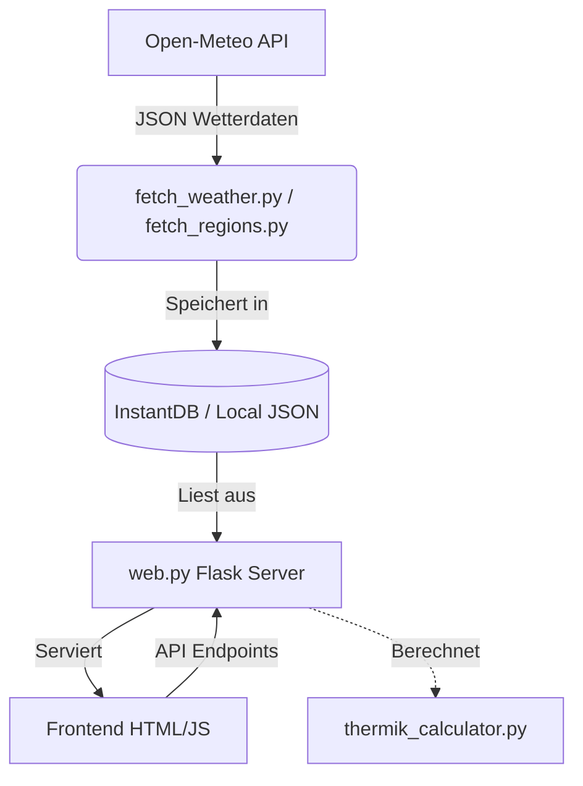

# Architektur des Systems

Der Uetliberg Ticker ist eine hybride Applikation bestehend aus einem Python-Backend (Flask) und einem interaktiven Frontend (Vanilla JS + D3.js).

## Komponenten-Übersicht

## 1. Datenbeschaffung
Zwei Hauptskripte kümmern sich um das periodische Abrufen der Daten:
- `fetch_weather.py`: Holt detaillierte Zeitreihen für den Hauptstandort (Uetliberg/Zürich).
- `fetch_regions.py`: Holt die Vorhersagen für alle 24 definierten Thermikregionen der Schweiz (via Batch-Request an `icon_seamless`).

## 2. Das Backend (`web.py`)
Das Flask-Backend liefert die HTML-Templates aus und stellt APIs für das Frontend bereit.
Aufgaben des Backends:
- Ausführen der Thermik-Berechnung (`thermik_calculator.py`) on-the-fly oder Auslesen von vorberechneten Daten.
- Formatieren der Daten für die D3.js Charts (`format_data_for_charts`).
- API-Routen wie `/api/region-weather/<region_id>` für das asynchrone Laden im Frontend bereitstellen.

## 3. Das Frontend
Das Frontend nutzt primär Vanilla CSS und JavaScript.
- **D3.js:** Wird stark für die Visualisierung der Wetter-Timelines genutzt (Temperatur, Windvektoren, Wolkenbasis, Thermik-Profil).
- **Leaflet:** Wird im `regions.html` Template genutzt, um eine interaktive Schweizer Karte mit eingefärbten Thermik-Polygone darzustellen.
