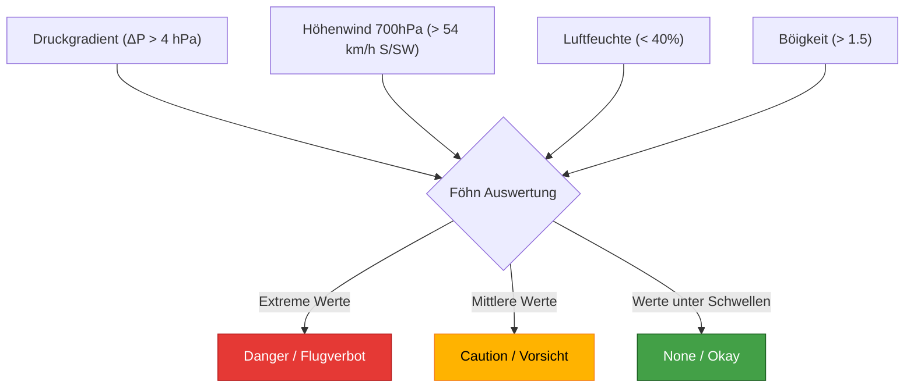

# Föhn & Bise Indikatoren

Der Uetliberg Ticker verfügt über ein Warnsystem für Föhn und Bise, da diese Windsysteme für Gleitschirmpiloten (und generell die Aviatik in den Alpen) gefährlich sein können.

**Skript:** `foehn_indicators.py`

## Das Prinzip des Südföhns
Südföhn entsteht, wenn auf der Alpensüdseite (z.B. in Lugano) höherer Luftdruck herrscht als auf der Alpennordseite (z.B. in Zürich). Luft fliesst immer vom hohen zum tiefen Druck. Das Alpenmassiv blockiert diesen Fluss teilweise, zwingt die Luft zum Aufsteigen und verursacht nach Überqueren des Kamms ein extremes, oft böiges und warmes Absinken (den Föhn).

```mermaid
flowchart LR
    Sued["Alpensüdseite (z.B. Lugano)\nHoher Druck, kühl & feucht"] -->|Windströmung| Luv[Luv-Aufstieg\n(Wolken/Regen)]
    Luv --> Kamm[Alpenhauptkamm]
    Kamm --> Lee[Lee-Absinken\n(Starke Erwärmung, abtrocknen)]
    Lee --> Nord["Alpennordseite (z.B. Zürich)\nTiefer Druck, warmer Sturm"]
    
    style Sued fill:#8aaae5,stroke:#333
    style Luv fill:#c4d3eb,stroke:#333
    style Kamm fill:#e0e0e0,stroke:#333,stroke-width:4px
    style Lee fill:#fbbd97,stroke:#333
    style Nord fill:#e85d04,stroke:#333,color:#fff
```

### Die 4 Warn-Kriterien

1. **Druckgradient (Delta-P)**
   - Formel: 
   $$
   \Delta P = p_{\text{Süd}} - p_{\text{Nord}}
   $$
   - *Vorsicht*: ab 4 hPa Druckdifferenz
   - *Gefahr*: ab 8 hPa Druckdifferenz (Flugverbot empfohlen)

2. **Höhenwind am Alpenhauptkamm (700 hPa)**
   - Windrichtung: S/SW (135° - 225°)
   - *Vorsicht*: ab 54 km/h (15 m/s)
   - *Gefahr*: ab 180 km/h (50 m/s)

3. **Luftfeuchtigkeit (Nord)**
   - Föhnluft ist extrem trocken, da sie beim Absinken erwärmt wird und abtrocknet.
   - Sinkt die relative Luftfeuchtigkeit in Zürich unter 40% (verbunden mit hohem Delta-P), ist der Föhn "durchgebrochen".

4. **Böigkeit**
   - Verhältnis:
   $$
   Q_{\text{Böe}} = \frac{v_{\text{Böe, 10m}}}{v_{\text{Mittel, 10m}}}
   $$
   - Ein Quotient $Q_{\text{Böe}} > 1.5$ deutet auf starke Turbulenzen hin, typisch für Föhn im Talboden.

## Auswertung & Dashboard
Die Funktion `get_foehn_for_dashboard` kombiniert diese Schwellenwerte stündlich. 
Resultat ist ein Statusfeld auf dem Dashboard (`danger`, `caution` oder `none`), das den Piloten visuell auf die Gefahr hinweist.


