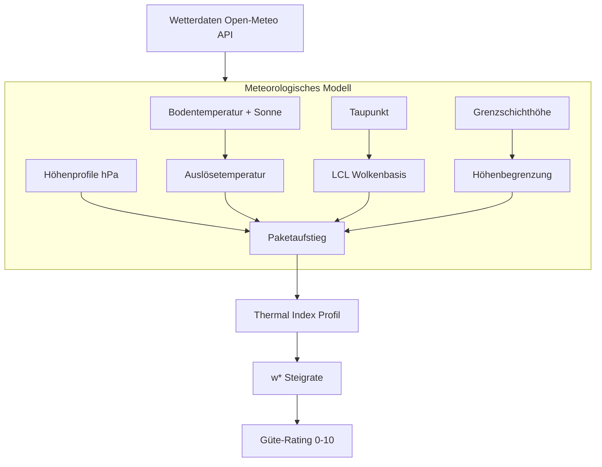
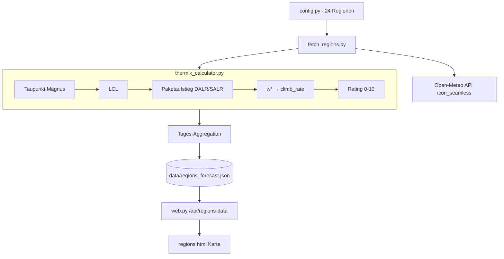

# Thermik-Berechnung im Uetliberg Ticker

## Überblick

Der Uetliberg Ticker berechnet für 24 Schweizer Thermikregionen ein stündliches **Thermik-Güte-Rating** (0–10). Die Berechnung simuliert physikalisch den Aufstieg eines Luftpakets vom Boden durch die Atmosphäre und leitet daraus erwartetes Steigen (m/s) und nutzbare Arbeitshöhe ab.

---

## 1. Eingangsdaten

Pro Region und Stunde werden folgende Werte von der **Open-Meteo API** (Modell: `icon_seamless`) bezogen:

| Parameter | Beschreibung |
|---|---|
| `temperature_2m` | Bodentemperatur in 2m Höhe (°C) |
| `dewpoint_2m` / `relative_humidity_2m` | Taupunkt oder relative Feuchte am Boden |
| `boundary_layer_height` | Grenzschichthöhe über Grund (m AGL) |
| `sunshine_duration` | Sonnenscheindauer in der Stunde (Sekunden, max 3600) |
| `cape` | Convective Available Potential Energy (J/kg) |
| `geopotential_height_{X}hPa` | Geopotentielle Höhe auf Druckniveau X (m MSL) |
| `temperature_{X}hPa` | Temperatur auf Druckniveau X (°C) |

**Druckniveaus:** 1000, 975, 950, 925, 900, 875, 850, 825, 800, 775, 750, 700, 600 hPa

Diese Niveaus decken den Bereich von ca. 0 m bis 4000 m MSL ab, in Schritten von ~200–250 m.

---

## 2. Taupunkt-Berechnung

Falls kein direkter Taupunkt geliefert wird, erfolgt die Berechnung über die **Magnus-Formel**:

$$
\alpha = \ln\left(\frac{RH}{100}\right) + \frac{A \cdot T}{B + T}
$$

$$
T_d = \frac{B \cdot \alpha}{A - \alpha}
$$

Konstanten: `A = 17.625`, `B = 243.04`

---

## 3. Auslösetemperatur (Trigger Temperature)

Die Sonne erwärmt den Boden stärker als die freie Atmosphäre. Das Modell addiert einen **Sonnenschein-Bonus** auf die Bodentemperatur:

$$
f_{\text{sun}} = \min\left(1.0, \frac{\text{sunshine\_duration}}{3600}\right)
$$

$$
T_{\text{trigger}}  = T_{\text{surface}} + 2.0 \cdot f_{\text{sun}}
$$

- Bei voller Sonne (3600s): +2.0 °C Überhitzung
- Bei bedecktem Himmel (0s): +0.0 °C
- Teilverhältnisse linear interpoliert

---

## 4. LCL – Wolkenbasis (Lifting Condensation Level)

Die Höhe, ab der das aufsteigende Luftpaket kondensiert (Wolkenbildung), wird mit der **Spread-Faustregel** berechnet:

$$
\text{Spread}  = T_{\text{trigger}} - T_{\text{dewpoint}}
$$

$$
LCL_{AGL} = \text{Spread}  \cdot 125 \text{ m/°C}
$$

$$
LCL_{MSL} = \text{Elevation} + LCL_{AGL}
$$

Ein Spread von 10 °C ergibt eine Wolkenbasis von 1250 m über Grund.

---

## 5. Paketaufstieg – Thermal Index Profil

Der Kern der Berechnung: Ein virtuelles Luftpaket steigt vom Boden auf und wird mit dem realen Höhenprofil verglichen.

### Trockenadiabatischer Aufstieg (unter LCL)

$$
T_{\text{parcel\_dry}}(h) = T_{\text{trigger}} - 0.0098 \cdot (h - \text{elevation})
$$

Das Paket kühlt mit dem **DALR** (Dry Adiabatic Lapse Rate) von **9.8 °C/km** ab.

### Feuchtadiabatischer Aufstieg (über LCL)

Über dem LCL wird Kondensationswärme frei. Die Abkühlung verlangsamt sich auf den **SALR** (Saturated Adiabatic Lapse Rate) von ca. **6.0 °C/km**:

$$
T_{\text{parcel\_wet}}(h) = T_{\text{trigger}} - 0.0098 \cdot (LCL - \text{elevation}) - 0.006 \cdot (h - LCL)
$$

### Thermal Index (TI)

Auf jeder Höhenschicht wird der TI berechnet:

$$
TI = T_{\text{environment}} - T_{\text{parcel}}
$$

| TI | Bedeutung |
|---|---|
| TI < 0 | Paket ist **wärmer** als Umgebung → **Steigen** |
| TI = 0 | Gleichgewicht (Thermik-Obergrenze) |
| TI > 0 | Paket ist **kälter** → Sinken, Inversion |

### Aufstiegs-Abbruch

Das Paket steigt, solange es mindestens gleich warm oder nur 0.5 °C kälter ist als die Umgebung (Trägheitstoleranz für eine reale Thermikblase):

$$
T_{\text{parcel}} < T_{\text{environment}} - 0.5 \text{ °C}
$$

Die letzte Höhe, auf der das Paket noch steigt, definiert die **maximale Thermikhöhe**.

---

## 6. Grenzschicht-Begrenzung

Die Grenzschichthöhe (Boundary Layer Height) begrenzt die Thermik zusätzlich:

$$
BLH_{MSL} = \text{Elevation} + BLH_{AGL}
$$

$$
H_{\text{thermal\_max}} = \min(H_{\text{thermal\_max}}, BLH_{MSL})
$$

Die Grenzschicht ist die turbulente, durchmischte Schicht über dem Boden. Thermik durchstösst selten deren Obergrenze.

---

## 7. Steigrate w* (Convective Velocity Scale)

Aus der mittleren Temperaturdifferenz und der Thermiktiefe wird die **konvektive Geschwindigkeitsskala** abgeleitet:

$$
\overline{\Delta T} = \frac{\sum (T_{\text{parcel}} - T_{\text{environment}})}{N_{\text{Schichten}}}
$$

$$
H_{\text{depth}} = H_{\text{thermal\_max}} - \text{elevation}
$$

$$
w^* = \sqrt{\frac{g}{T_{\text{surface}} + 273.15} \cdot \overline{\Delta T} \cdot H_{\text{depth}} }
$$

Dabei ist `g = 9.81 m/s²`.

### Kalibrierung auf Gleitschirm-Variowerte

Das physikalische w* gibt die Geschwindigkeit der Luftmassenkonvektion an. Ein Gleitschirmpilot im Bart erlebt weniger:

$$
\text{climb\_rate} = w^* \cdot 0.3 \cdot f_{\text{sun}}
$$

- Faktor **0.3**: Empirische Kalibrierung (Paketmitte steigt schneller als der Schirm, Abwind am Rand, etc.)
- **sun_factor**: Reduziert Steigen proportional zur tatsächlichen Sonnenscheindauer
- Maximum: **6.0 m/s** (Obergrenze für Alpen-Thermik)

### Mindesthöhe

Ist die nutzbare Thermikhöhe weniger als 300 m über Grund, wird die Thermik als **nicht nutzbar** gewertet:

$$
\text{falls } H_{\text{thermal\_max}} < \text{elevation} + 300\text{m}: \text{ Steigrate } = 0.0 \text{ m/s}
$$

---

## 8. Güte-Rating (0–10)

Das stündliche Rating leitet sich direkt aus der Steigrate ab:

| Steigen (m/s) | Rating | Einordnung |
|---|---|---|
| < 0.5 | 0 | Keine Thermik |
| 0.5 – 1.2 | 3 | Schwache Thermik |
| 1.2 – 2.0 | 5 | Moderate Thermik |
| 2.0 – 3.5 | 8 | Gute bis starke Thermik |
| > 3.5 | 10 | Sehr starke Thermik |

---

## 9. Tages-Aggregation

Für die Landkarte werden die stündlichen Werte (Flugstunden 09:00–18:00) zu einem **Tageswert pro Region** verdichtet:

| Tageswert | Aggregation |
|---|---|
| `climb_rate` | Maximum aller Stundenwerte |
| `rating` | Mittelwert der besten 3 Stunden |
| `max_height` | Maximum aller Stundenwerte |
| `lcl` | Durchschnitt aller Stunden mit LCL > 0 |
| `cape` | Maximum aller Stundenwerte |

Die **Top-3-Regel** beim Rating verhindert, dass eine einzelne gute Stunde den Tageswert dominiert, erlaubt aber dennoch gute Wertungen wenn das Thermiknachmittags-Fenster kurz ist.

---

## 10. Datenfluss-Architektur

---

## Physikalische Konstanten

| Konstante | Wert | Beschreibung |
|---|---|---|
| g | 9.81 m/s² | Erdbeschleunigung |
| cp | 1005 J/(kg·K) | Spezifische Wärmekapazität trockener Luft |
| R_d | 287.05 J/(kg·K) | Gaskonstante trockene Luft |
| L_v | 2.5 × 10⁶ J/kg | Verdampfungswärme Wasser |
| DALR | 9.8 °C/km | Trockenadiabatischer Gradient |
| SALR | ~6.0 °C/km | Feuchtadiabatischer Gradient (vereinfacht) |

---

## Quellen und Referenzen

- **Deardorff (1970)**: Convective velocity scale w* — Grundlage der Steigrate-Berechnung
- **Magnus-Formel**: Standard-Approximation für Sättigungsdampfdruck → Taupunkt
- **LCL-Approximation**: Eaton (1917), Spread × 125 m/°C — bewährte Piloten-Faustregel
- **Open-Meteo API**: Wetterdaten-Quelle, Modell ICON (DWD) seamless
- **swissBOUNDARIES3D**: Grundlage der 24 Thermikregionen-Polygone (Swisstopo)
